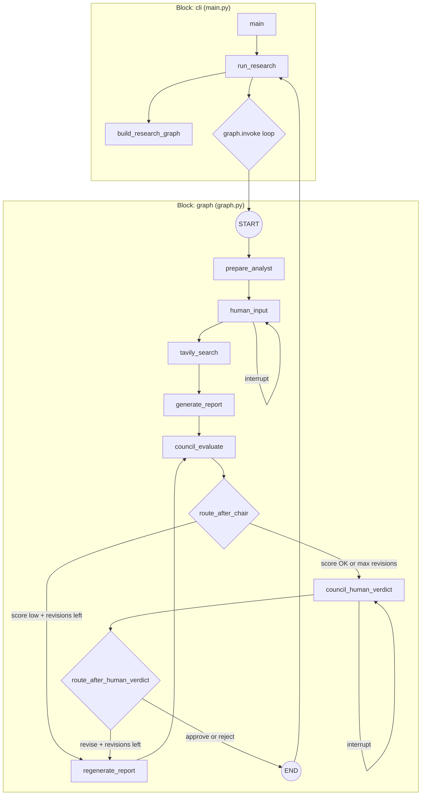
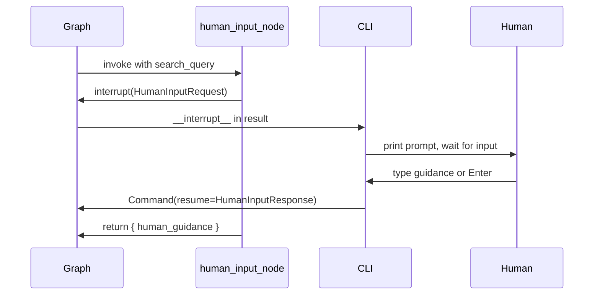
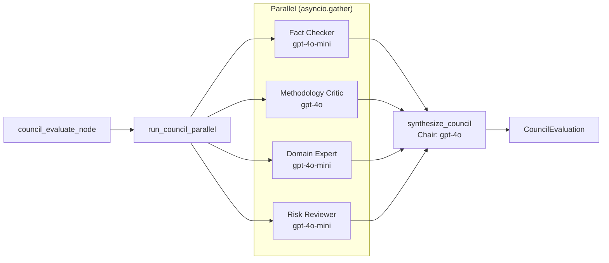
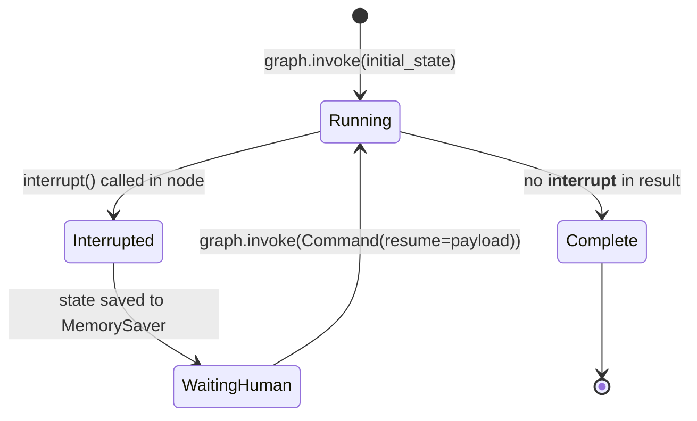

# Functional Flow Reference

This document shows the **exact block-by-block execution flow** of the LangGraph Research Assistant, including which **state fields** are read and written at each step, where **interrupts** pause execution, and how **routing decisions** choose the next block.

---

## 1. Global State Object

All blocks share a single `ResearchState` object that LangGraph merges after each node.

```python
class ResearchState(TypedDict):
    analyst: Analyst                    # Input persona (set once at start)
    human_guidance: Optional[str]       # Pre-search human notes
    search_query: str                   # Tavily query (may be enriched)
    search_results: list[dict]          # Raw Tavily results
    report: Optional[ResearchReport]    # Generated/revised report
    council_evaluation: Optional[CouncilEvaluation]  # Council verdict
    revision_count: int                 # Number of revision cycles (0, 1, 2...)
    revision_feedback: Optional[str]    # Council/human notes for rewrite
    human_approved: Optional[bool]      # Final human verdict
    usage: UsageSummary                 # Accumulated token/cost tracking
    messages: list                      # LangGraph message history
```

### Initial State (CLI entry)

```
analyst            = Analyst(name, role, description)   ← user input
human_guidance     = None
search_query       = ""
search_results     = []
report             = None
council_evaluation = None
revision_count     = 0
revision_feedback  = None
human_approved     = None
usage              = UsageSummary()
messages           = []
```

---

## 2. Top-Level Block Diagram



---

## 3. Step-by-Step Flow with State Transitions

Each row shows: **Block → Function → State read → State written → Next block**.

### Step 0 — CLI startup

```
┌─────────────┬──────────────────┬─────────────────────────────────────────────────────┐
│ Block       │ Function         │ Action                                              │
├─────────────┼──────────────────┼─────────────────────────────────────────────────────┤
│ cli         │ main()           │ Parse CLI args → build Analyst                      │
│ cli         │ run_research()   │ Build graph, create initial ResearchState           │
│ graph       │ build_research_graph() │ Compile StateGraph with checkpointer        │
└─────────────┴──────────────────┴─────────────────────────────────────────────────────┘

State IN:  analyst (from CLI)
State OUT: full initial ResearchState (see above)
Next:      graph.invoke #1
```

---

### Step 1 — prepare_analyst

```
┌─────────────┬──────────────────────────┬──────────────────────────────────────────────┐
│ Block       │ Function                 │ File                                         │
├─────────────┼──────────────────────────┼──────────────────────────────────────────────┤
│ nodes       │ prepare_analyst_node()   │ nodes.py                                     │
│ nodes       │ _get_llm()               │ nodes.py (helper)                            │
│ nodes       │ _get_model_name()        │ nodes.py (helper)                            │
│ usage       │ record_openai_usage()    │ usage.py                                     │
└─────────────┴──────────────────────────┴──────────────────────────────────────────────┘

State READ:  analyst, usage
State WRITE: search_query        ← LLM generates query from analyst profile
             search_results     ← []  (reset)
             report             ← None (reset)
             council_evaluation ← None (reset)
             human_approved     ← None (reset)
             usage              ← +prepare_analyst tokens

Next:        human_input
```

---

### Step 2 — human_input (INTERRUPT #1)

```
┌─────────────┬──────────────────────────┬──────────────────────────────────────────────┐
│ Block       │ Function                 │ File                                         │
├─────────────┼──────────────────────────┼──────────────────────────────────────────────┤
│ nodes       │ human_input_node()       │ nodes.py                                     │
│ cli         │ _print_guidance_interrupt()│ main.py (on resume)                        │
│ cli         │ _collect_guidance_response()│ main.py (on resume)                       │
└─────────────┴──────────────────────────┴──────────────────────────────────────────────┘

State READ:  analyst, search_query
State WRITE: human_guidance       ← from HumanInputResponse.additional_guidance

Interrupt payload (OUT to human):
  type     = "human_guidance"
  message  = "Research is being prepared for {name}..."
  analyst  = Analyst(...)
  optional = True

Resume payload (IN from human):
  { "additional_guidance": "Focus on Q4 trials" }   or null

Next:        tavily_search  (after Command(resume=...) from CLI)
```



---

### Step 3 — tavily_search

```
┌─────────────┬──────────────────────────┬──────────────────────────────────────────────┐
│ Block       │ Function                 │ File                                         │
├─────────────┼──────────────────────────┼──────────────────────────────────────────────┤
│ nodes       │ tavily_search_node()     │ nodes.py                                     │
│ nodes       │ _get_tavily_search()     │ nodes.py (helper)                            │
│ nodes       │ _get_search_depth()      │ nodes.py (helper)                            │
│ usage       │ record_tavily_usage()    │ usage.py                                     │
└─────────────┴──────────────────────────┴──────────────────────────────────────────────┘

State READ:  analyst, search_query, human_guidance, usage
State WRITE: search_query        ← enriched if human_guidance present
             search_results      ← list of Tavily result dicts
             usage               ← +tavily credits

Next:        generate_report
```

---

### Step 4 — generate_report

```
┌─────────────┬──────────────────────────┬──────────────────────────────────────────────┐
│ Block       │ Function                 │ File                                         │
├─────────────┼──────────────────────────┼──────────────────────────────────────────────┤
│ nodes       │ generate_report_node()   │ nodes.py                                     │
│ nodes       │ _build_report()          │ nodes.py (helper)                            │
│ usage       │ record_openai_usage()    │ usage.py                                     │
└─────────────┴──────────────────────────┴──────────────────────────────────────────────┘

State READ:  analyst, search_query, search_results, human_guidance, usage
State WRITE: report              ← ResearchReport (title, summary, findings, sources...)
             usage               ← +generate_report tokens

Next:        council_evaluate
```

---

### Step 5 — council_evaluate

```
┌─────────────┬──────────────────────────┬──────────────────────────────────────────────┐
│ Block       │ Function                 │ File                                         │
├─────────────┼──────────────────────────┼──────────────────────────────────────────────┤
│ nodes       │ council_evaluate_node()  │ nodes.py                                     │
│ council     │ run_council_parallel()   │ council.py  (4 reviewers in parallel)        │
│ council     │ _evaluate_member_async() │ council.py  (×4)                             │
│ council     │ _evaluate_member_sync()  │ council.py  (×4)                             │
│ council     │ synthesize_council()     │ council.py  (chair)                          │
│ usage       │ record_openai_usage()    │ usage.py  (×5 calls)                         │
└─────────────┴──────────────────────────┴──────────────────────────────────────────────┘

State READ:  analyst, report, search_results, revision_feedback, revision_count, usage
State WRITE: council_evaluation  ← CouncilEvaluation (scores, verdict, synthesis)
             report              ← report.council_evaluation attached
             usage               ← +4 reviewer + 1 chair token records

Next:        route_after_chair (conditional)
```

#### Internal council sub-flow



Each reviewer receives:
```
report, analyst, search_results[:5], revision_feedback
```
Each reviewer returns:
```
CouncilMemberReview(reviewer_name, overall_score, recommendation, feedback, ...)
```

Chair receives all 4 reviews and returns:
```
CouncilEvaluation(consensus_score, final_verdict, synthesis, revision_priorities)
```

---

### Step 6 — route_after_chair (routing block)

```
┌─────────────┬──────────────────────────┬──────────────────────────────────────────────┐
│ Block       │ Function                 │ File                                         │
├─────────────┼──────────────────────────┼──────────────────────────────────────────────┤
│ routing     │ route_after_chair()      │ nodes.py                                     │
│ council     │ get_council_threshold()  │ council.py  (default 7.0)                    │
│ council     │ get_max_revisions()      │ council.py  (default 2)                      │
└─────────────┴──────────────────────────┴──────────────────────────────────────────────┘

State READ:  council_evaluation, revision_count

Decision:
  IF consensus_score < 7.0  OR  final_verdict in {needs_revision, rejected}
     AND revision_count < 2
        → regenerate_report
  ELSE
        → council_human_verdict
```

| Condition | `consensus_score` | `final_verdict` | `revision_count` | Route |
|-----------|-------------------|-----------------|------------------|-------|
| Pass | ≥ 7.0 | `approved` | any | `council_human_verdict` |
| Auto-revise | < 7.0 | `needs_revision` | 0 or 1 | `regenerate_report` |
| Max revisions hit | < 7.0 | `needs_revision` | ≥ 2 | `council_human_verdict` |
| Rejected + can revise | any | `rejected` | 0 or 1 | `regenerate_report` |

---

### Step 7a — regenerate_report (revision loop)

```
┌─────────────┬──────────────────────────┬──────────────────────────────────────────────┐
│ Block       │ Function                 │ File                                         │
├─────────────┼──────────────────────────┼──────────────────────────────────────────────┤
│ nodes       │ regenerate_report_node() │ nodes.py                                     │
│ nodes       │ _build_report()          │ nodes.py (with revision_feedback)            │
└─────────────┴──────────────────────────┴──────────────────────────────────────────────┘

State READ:  analyst, search_query, search_results, human_guidance,
             council_evaluation, revision_feedback, revision_count, usage

State WRITE: report              ← new ResearchReport addressing feedback
             revision_count      ← incremented (+1)
             revision_feedback   ← combined council + human notes
             council_evaluation  ← None (cleared for re-evaluation)
             usage               ← +regenerate_report_N tokens

Next:        council_evaluate  (loop back to Step 5)
```

---

### Step 7b — council_human_verdict (INTERRUPT #2)

```
┌─────────────┬──────────────────────────┬──────────────────────────────────────────────┐
│ Block       │ Function                 │ File                                         │
├─────────────┼──────────────────────────┼──────────────────────────────────────────────┤
│ nodes       │ council_human_verdict_node()│ nodes.py                                  │
│ cli         │ _print_council_interrupt() │ main.py                                    │
│ cli         │ _collect_council_verdict() │ main.py                                    │
└─────────────┴──────────────────────────┴──────────────────────────────────────────────┘

State READ:  report, council_evaluation

Interrupt payload (OUT to human):
  type             = "council_verdict"
  evaluation       = CouncilEvaluation
  consensus_score  = float
  final_verdict    = str
  report_title     = str

Resume payload (IN from human):
  { "decision": "approve" | "revise" | "reject", "human_notes": optional str }

State WRITE:
  approve → human_approved = True
  reject  → human_approved = False
  revise  → human_approved = None, revision_feedback = human_notes or council synthesis

Next:        route_after_human_verdict (conditional)
```

---

### Step 8 — route_after_human_verdict (routing block)

```
┌─────────────┬──────────────────────────┬──────────────────────────────────────────────┐
│ Block       │ Function                 │ File                                         │
├─────────────┼──────────────────────────┼──────────────────────────────────────────────┤
│ routing     │ route_after_human_verdict()│ nodes.py                                   │
│ council     │ get_max_revisions()      │ council.py                                   │
└─────────────┴──────────────────────────┴──────────────────────────────────────────────┘

State READ:  human_approved, revision_feedback, revision_count

Decision:
  IF human_approved == True          → END
  IF revision_feedback AND count < 2 → regenerate_report
  ELSE                               → END
```

| Human input | `human_approved` | `revision_feedback` | Route |
|-------------|------------------|---------------------|-------|
| `approve` | `True` | — | `END` |
| `reject` | `False` | — | `END` |
| `revise: fix sources` | `None` | notes set | `regenerate_report` (if count < 2) |

---

### Step 9 — CLI output

```
┌─────────────┬──────────────────────────┬──────────────────────────────────────────────┐
│ Block       │ Function                 │ File                                         │
├─────────────┼──────────────────────────┼──────────────────────────────────────────────┤
│ cli         │ _print_report()          │ main.py                                      │
│ cli         │ _print_council_evaluation()│ main.py                                    │
│ cli         │ _print_usage()           │ main.py                                      │
└─────────────┴──────────────────────────┴──────────────────────────────────────────────┘

State READ:  report (with council_evaluation, usage, human_approved attached)
Output:      formatted report + council scores + token/cost breakdown
```

---

## 4. Complete State Evolution (Happy Path)

Example run where council passes on first try and human approves:

```
Step  Block                  Key state after step
────  ─────────────────────  ─────────────────────────────────────────────────────
 0    cli/main               analyst=Dr. Chen, revision_count=0
 1    nodes/prepare_analyst  search_query="biotech FDA approvals 2025"
 2    nodes/human_input      human_guidance=None
 3    nodes/tavily_search    search_results=[5 Tavily hits]
 4    nodes/generate_report  report.title="Biotech Pipeline Review"
 5    nodes/council_evaluate council_evaluation.consensus_score=8.2
                               council_evaluation.final_verdict="approved"
 6    routing/route_after_chair  → council_human_verdict
 7    nodes/council_human_verdict  human_approved=True
 8    routing/route_after_human_verdict  → END
 9    cli/_print_report      final output printed
```

---

## 5. Complete State Evolution (Revision Loop Path)

Example where council score is low, auto-revises once, then human approves:

```
Step  Block                         Key state after step
────  ────────────────────────────  ─────────────────────────────────────────────────
 0-4   (same as above)               report v1 generated
 5    council_evaluate              consensus_score=5.8, verdict="needs_revision"
 6    route_after_chair             → regenerate_report (count=0 < 2)
 7    regenerate_report             revision_count=1, report v2, council_eval=None
 5    council_evaluate (again)      consensus_score=7.5, verdict="approved"
 6    route_after_chair             → council_human_verdict
 7    council_human_verdict         human types "approve"
 8    route_after_human_verdict     → END
```

---

## 6. Block Dependency Map

Which blocks call which other blocks:

```
main.py (cli)
  └── build_research_graph()          graph.py
  └── graph.invoke()                  triggers node chain below

nodes.py
  ├── prepare_analyst_node
  │     └── _get_llm(), record_openai_usage()
  ├── human_input_node
  │     └── interrupt() → CLI resume
  ├── tavily_search_node
  │     └── _get_tavily_search(), record_tavily_usage()
  ├── generate_report_node
  │     └── _build_report(), record_openai_usage()
  ├── council_evaluate_node
  │     └── run_council_parallel()    council.py
  │     └── synthesize_council()      council.py
  ├── regenerate_report_node
  │     └── _build_report(), record_openai_usage()
  ├── council_human_verdict_node
  │     └── interrupt() → CLI resume
  ├── route_after_chair()             routing (no state write)
  └── route_after_human_verdict()     routing (no state write)

council.py
  ├── run_council_parallel()
  │     └── _evaluate_member_async() ×4
  │           └── _evaluate_member_sync() ×4
  │                 └── record_openai_usage() ×4
  └── synthesize_council()
        └── record_openai_usage()

usage.py
  ├── record_openai_usage()
  │     └── _extract_token_counts(), _get_model_pricing()
  └── record_tavily_usage()
        └── UsageSummary.add_step()
              └── UsageSummary._recompute_totals()
```

---

## 7. Interrupt & Resume Lifecycle

LangGraph requires a **checkpointer** and **thread_id** to survive interrupts.



| Interrupt # | Node | Resume command | Payload shape |
|-------------|------|----------------|---------------|
| 1 | `human_input` | `Command(resume={...})` | `{ "additional_guidance": str \| null }` |
| 2 | `council_human_verdict` | `Command(resume={...})` | `{ "decision": str, "human_notes": str \| null }` |

The CLI `run_research()` loop handles both automatically:

```python
while result.get("__interrupt__"):
    if payload["type"] == "council_verdict":
        stream_input = Command(resume=council_verdict_response)
    else:
        stream_input = Command(resume=guidance_response)
    result = graph.invoke(stream_input, config=config)
```

---

## 8. Trace Lines per Block

When running, each block emits trace lines matching this document:

| Block | Trace prefix | Example |
|-------|-------------|---------|
| CLI | `[cli]` | `>>> [cli] run_research — INVOKE \| graph.invoke #1` |
| Graph | `[graph]` | `>>> [graph] build_research_graph — EXIT` |
| Nodes | `[nodes]` | `>>> [nodes] tavily_search_node — EXIT \| results=5` |
| Council | `[council]` | `>>> [council] synthesize_council — EXIT \| score=8.2` |
| Routing | `[routing]` | `>>> [routing] route_after_chair — ROUTE \| next=regenerate_report` |
| Usage | `[usage]` | `>>> [usage] record_openai_usage — ENTER \| step=prepare_analyst` |

See [README.md — Execution Tracing](./README.md#execution-tracing) for full trace documentation.
