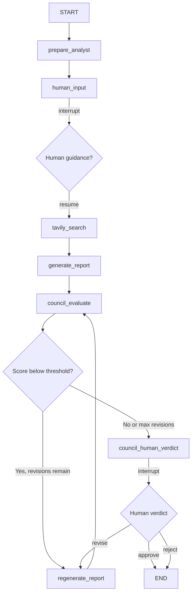

# LangGraph Research Assistant

A LangGraph workflow that accepts an **analyst persona** (role, name, description), pauses for **optional human input**, searches the web with **Tavily**, generates a **structured research report**, and evaluates it with an **advanced model council** before final approval. Built-in **execution tracing** logs every function call so you can follow the exact flow in the terminal.

## Architecture



| Node | Purpose |
|------|---------|
| `prepare_analyst` | Builds an initial search query from the analyst profile |
| `human_input` | Pauses via `interrupt()` for optional pre-search guidance |
| `tavily_search` | Runs Tavily search with analyst context + human guidance |
| `generate_report` | LLM writes a structured `ResearchReport` from search results |
| `council_evaluate` | Four parallel reviewers + chair synthesize a council evaluation |
| `regenerate_report` | Rewrites the report using council or human revision feedback |
| `council_human_verdict` | Pauses for human approve / revise / reject after council review |

## Execution Tracing

Every function in the workflow emits trace lines to the terminal so you can follow execution from both a **functional** (which function ran) and **block** (which module/layer) standpoint.

### Trace Format

```
>>> [block] function_name — PHASE | detail
```

| Part | Meaning |
|------|---------|
| `[block]` | Logical code block — `cli`, `graph`, `nodes`, `council`, `routing`, or `usage` |
| `function_name` | The function being entered, exited, or routed |
| `PHASE` | One of `ENTER`, `EXIT`, `INTERRUPT`, `ROUTE`, or `INVOKE` |
| `detail` | Optional context (analyst name, scores, routing target, etc.) |

### Example Output

Running `python main.py ...` produces trace lines like:

```
>>> [cli] main — ENTER
>>> [cli] run_research — ENTER | analyst=Dr. Sarah Chen, thread=None
>>> [graph] build_research_graph — ENTER
>>> [graph] build_research_graph — EXIT | graph compiled
>>> [cli] run_research — INVOKE | graph.invoke #1
>>> [nodes] prepare_analyst_node — ENTER | analyst=Dr. Sarah Chen
>>> [nodes] _get_llm — ENTER
>>> [nodes] _get_llm — EXIT | model=gpt-4o-mini
>>> [usage] record_openai_usage — ENTER | step=prepare_analyst, model=gpt-4o-mini
>>> [nodes] prepare_analyst_node — EXIT | search_query='biotech FDA approvals 2025'
>>> [nodes] human_input_node — ENTER | analyst=Dr. Sarah Chen
>>> [nodes] human_input_node — INTERRUPT | waiting for human guidance
>>> [cli] run_research — INTERRUPT | type=human_guidance
>>> [nodes] tavily_search_node — ENTER | query='biotech FDA approvals 2025'
>>> [nodes] generate_report_node — ENTER
>>> [nodes] council_evaluate_node — ENTER | report='Biotech Pipeline Review'
>>> [council] run_council_parallel — ENTER | members=['Fact Checker', 'Methodology Critic', ...]
>>> [council] synthesize_council — EXIT | score=8.2, verdict=approved
>>> [routing] route_after_chair — ROUTE | next=council_human_verdict
>>> [nodes] council_human_verdict_node — INTERRUPT | waiting for human verdict
>>> [cli] run_research — EXIT | title='Biotech Pipeline Review'
>>> [cli] main — EXIT
```

### Trace Blocks

| Block | What it covers |
|-------|----------------|
| `cli` | CLI entry point, interrupt handlers, report printing (`main.py`) |
| `graph` | LangGraph assembly and compilation (`graph.py`) |
| `nodes` | All LangGraph node functions and helpers (`nodes.py`) |
| `council` | Parallel reviewers, chair synthesis, config getters (`council.py`) |
| `routing` | Conditional edge decisions after council and human verdict (`nodes.py`) |
| `usage` | Token counting, cost calculation, usage aggregation (`usage.py`) |

### Phase Types

| Phase | When it appears |
|-------|-----------------|
| `ENTER` | Function starts executing |
| `EXIT` | Function finishes (often with a result summary) |
| `INTERRUPT` | Graph pauses for human input |
| `ROUTE` | Conditional edge chooses the next node |
| `INVOKE` | CLI calls `graph.invoke()` (numbered per resume cycle) |

Tracing is always on and uses `flush=True` so lines appear immediately — even during long LLM calls. The helper lives in `research_assistant/trace.py`:

```python
from research_assistant.trace import trace

trace("nodes", "prepare_analyst_node", "ENTER", f"analyst={analyst.name}")
# >>> [nodes] prepare_analyst_node — ENTER | analyst=Dr. Sarah Chen
```

## Advanced Model Council

After the initial report is generated, an **advanced model council** evaluates it before the workflow finishes.

### Council Members (Parallel Review)

Four reviewers run **in parallel**, each with a different model and evaluation focus:

| Reviewer | Default Model | Focus |
|----------|---------------|-------|
| **Fact Checker** | `gpt-4o-mini` | Verifies claims against cited sources; flags hallucinations |
| **Methodology Critic** | `gpt-4o` | Evaluates logical structure, completeness, and reasoning |
| **Domain Expert** | `gpt-4o-mini` | Checks fit with the analyst persona and domain standards |
| **Risk Reviewer** | `gpt-4o-mini` | Identifies bias, blind spots, and overconfident claims |

Each reviewer returns a structured score (1–10), strengths, weaknesses, and a recommendation: `approve`, `revise`, or `reject`.

### Council Chair

A **chair model** (`gpt-4o` by default) synthesizes all member reviews into a final `CouncilEvaluation`:

- **Consensus score** — weighted average across reviewers
- **Final verdict** — `approved`, `needs_revision`, or `rejected`
- **Synthesis** — chair summary of the deliberation
- **Revision priorities** — top issues to fix if a rewrite is needed

### Auto-Revision Loop

If the consensus score is **below the threshold** (default `7.0/10`) or the verdict is `needs_revision`, the graph automatically:

1. Sends council feedback to `regenerate_report`
2. Re-runs the council evaluation on the revised draft
3. Repeats up to **`COUNCIL_MAX_REVISIONS`** times (default: 2)

This happens **before** the human verdict interrupt, so low-quality drafts are improved automatically. Trace lines show each revision cycle:

```
>>> [routing] route_after_chair — ROUTE | next=regenerate_report (score=6.2, revisions=0)
>>> [nodes] regenerate_report_node — ENTER | revision=1
>>> [nodes] council_evaluate_node — ENTER | report='Biotech Pipeline Review'
```

### Human Verdict Interrupt

Once the council passes (or max revisions are reached), a **second interrupt** asks for your final decision:

```
Type one of: approve | revise | reject
Add notes after a colon, e.g.  revise: strengthen source citations
```

| Decision | What happens |
|----------|--------------|
| `approve` | Workflow ends; report is marked human-approved |
| `revise` | Report is regenerated using your notes, then re-evaluated by the council |
| `reject` | Workflow ends; report is marked human-rejected |

## Setup

```bash
python -m venv .venv
source .venv/bin/activate
pip install -r requirements.txt
cp .env.example .env
# Edit .env with your OPENAI_API_KEY and TAVILY_API_KEY
```

Get a free Tavily API key at [app.tavily.com](https://app.tavily.com/sign-in).

## Usage

### CLI

```bash
python main.py \
  --name "Dr. Sarah Chen" \
  --role "Healthcare Equity Analyst" \
  --description "Specializes in biotech IPOs, FDA approvals, and oncology drug pipelines."
```

**Interrupt 1 — Research guidance** (before search):
- Press **Enter** to continue without extra guidance
- Type additional instructions (e.g. "Focus on Q4 2025 trial results")

**Interrupt 2 — Council verdict** (after council review):
- Type `approve` to accept the report
- Type `revise: your feedback` to request changes
- Type `reject` to reject the final report

Save JSON output:

```bash
python main.py \
  --name "Alex Rivera" \
  --role "Macro Strategist" \
  --description "Covers US rates, inflation, and Fed policy." \
  --json \
  --output report.json
```

To capture trace output alongside the report:

```bash
python main.py \
  --name "Dr. Sarah Chen" \
  --role "Healthcare Equity Analyst" \
  --description "Specializes in biotech IPOs and FDA approvals." \
  2>&1 | tee run_trace.log
```

### Python API

```python
from research_assistant import Analyst, build_research_graph
from research_assistant.usage import UsageSummary
from langgraph.types import Command

graph = build_research_graph()
config = {"configurable": {"thread_id": "research-001"}}

analyst = Analyst(
    name="Dr. Sarah Chen",
    role="Healthcare Equity Analyst",
    description="Specializes in biotech IPOs and FDA approvals.",
)

result = graph.invoke(
    {
        "analyst": analyst,
        "human_guidance": None,
        "search_query": "",
        "search_results": [],
        "report": None,
        "council_evaluation": None,
        "revision_count": 0,
        "revision_feedback": None,
        "human_approved": None,
        "usage": UsageSummary(),
        "messages": [],
    },
    config=config,
)

while result.get("__interrupt__"):
    payload = result["__interrupt__"][0].value
    if payload.get("type") == "council_verdict":
        result = graph.invoke(
            Command(resume={"decision": "approve"}),
            config=config,
        )
    else:
        result = graph.invoke(
            Command(resume={"additional_guidance": "Focus on recent FDA decisions"}),
            config=config,
        )

report = result["report"]
print(report.title)
print(report.council_evaluation.consensus_score)
```

## Structured Output

### Research Report

```python
class ResearchReport(BaseModel):
    analyst_name: str
    analyst_role: str
    title: str
    executive_summary: str
    key_findings: list[str]
    detailed_analysis: str
    recommendations: list[str]
    sources: list[Source]
    generated_at: str
    usage: Optional[UsageSummary]
    council_evaluation: Optional[CouncilEvaluation]
    human_approved: Optional[bool]
```

### Council Evaluation

```python
class CouncilMemberReview(BaseModel):
    reviewer_name: str
    reviewer_role: str
    model_used: str
    overall_score: float          # 1-10
    factual_accuracy_score: float
    analytical_rigor_score: float
    domain_fit_score: float
    strengths: list[str]
    weaknesses: list[str]
    recommendation: str             # approve | revise | reject
    feedback: str

class CouncilEvaluation(BaseModel):
    member_reviews: list[CouncilMemberReview]
    consensus_score: float
    final_verdict: str              # approved | needs_revision | rejected
    synthesis: str
    revision_priorities: list[str]
    revision_count: int
    threshold_used: float
```

## Token Usage & Cost

Every LLM call (report generation, council reviewers, chair) and Tavily search is tracked in a `UsageSummary` attached to the final report. The CLI prints a breakdown after the report:

```
============================================================
TOKEN USAGE & COST
============================================================

prepare_analyst (openai / gpt-4o-mini)
  Prompt tokens     : 85
  Completion tokens : 12
  ...

council_fact_checker (openai / gpt-4o-mini)
  ...

council_chair (openai / gpt-4o)
  ...

--- Totals ---
  Estimated total cost  : $0.042000
```

Use `--json` to include usage data in the saved report file.

## Environment Variables

| Variable | Required | Default | Description |
|----------|----------|---------|-------------|
| `OPENAI_API_KEY` | Yes | — | OpenAI API key |
| `TAVILY_API_KEY` | Yes | — | Tavily API key for web search |
| `OPENAI_MODEL` | No | `gpt-4o-mini` | Model for query + report generation |
| `TAVILY_MAX_RESULTS` | No | `5` | Max Tavily search results |
| `TAVILY_SEARCH_DEPTH` | No | `advanced` | Tavily search depth |
| `COUNCIL_THRESHOLD` | No | `7.0` | Minimum consensus score to auto-pass |
| `COUNCIL_MAX_REVISIONS` | No | `2` | Max automatic/human revision cycles |
| `COUNCIL_CHAIR_MODEL` | No | `gpt-4o` | Chair synthesizer model |
| `COUNCIL_METHODOLOGY_MODEL` | No | `gpt-4o` | Methodology Critic model |
| `COUNCIL_FACT_CHECKER_MODEL` | No | `gpt-4o-mini` | Fact Checker model |
| `COUNCIL_DOMAIN_MODEL` | No | `gpt-4o-mini` | Domain Expert model |
| `COUNCIL_RISK_MODEL` | No | `gpt-4o-mini` | Risk Reviewer model |
| `TAVILY_CREDIT_COST_USD` | No | `0.008` | Estimated cost per Tavily credit |

## Project Layout

```
research_assistant/
  __init__.py      # Public exports
  models.py        # Analyst, ResearchReport, CouncilEvaluation, interrupt payloads
  state.py         # LangGraph TypedDict state
  nodes.py         # Graph node functions
  graph.py         # Graph builder with council routing
  council.py       # Parallel reviewers + chair synthesis
  usage.py         # Token usage and cost tracking
  trace.py         # Execution tracing helper (ENTER/EXIT/ROUTE/INTERRUPT)
main.py            # CLI entry point with dual interrupt handling
requirements.txt
.env.example
```
