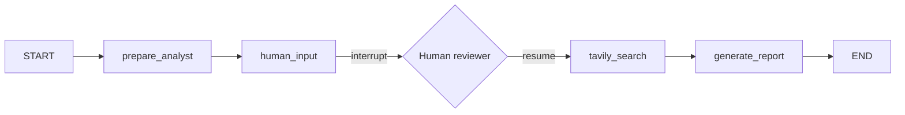

# LangGraph Research Assistant

A LangGraph workflow that accepts an **analyst persona** (role, name, description), pauses for **optional human input**, searches the web with **Tavily**, and produces a **structured research report**.

## Architecture



| Node | Purpose |
|------|---------|
| `prepare_analyst` | Builds an initial search query from the analyst profile |
| `human_input` | Pauses via `interrupt()` for optional reviewer guidance |
| `tavily_search` | Runs Tavily search with analyst context + human guidance |
| `generate_report` | LLM writes a structured `ResearchReport` from search results |

## Setup

```bash
python -m venv .venv
source .venv/bin/activate
pip install -r requirements.txt
cp .env.example .env
# Edit .env with your OPENAI_API_KEY and TAVILY_API_KEY
```

Get a free Tavily API key at [app.tavily.com](https://app.tavily.com/sign-in).

## Usage

### CLI

```bash
python main.py \
  --name "Dr. Sarah Chen" \
  --role "Healthcare Equity Analyst" \
  --description "Specializes in biotech IPOs, FDA approvals, and oncology drug pipelines."
```

When the graph hits the human-input interrupt, you can:
- Press **Enter** to continue without extra guidance
- Type additional instructions (e.g. "Focus on Q4 2025 trial results")

Save JSON output:

```bash
python main.py \
  --name "Alex Rivera" \
  --role "Macro Strategist" \
  --description "Covers US rates, inflation, and Fed policy." \
  --json \
  --output report.json
```

### Python API

```python
from research_assistant import Analyst, build_research_graph
from langgraph.types import Command

graph = build_research_graph()
config = {"configurable": {"thread_id": "research-001"}}

analyst = Analyst(
    name="Dr. Sarah Chen",
    role="Healthcare Equity Analyst",
    description="Specializes in biotech IPOs and FDA approvals.",
)

# First invoke — may pause at human_input interrupt
result = graph.invoke(
    {
        "analyst": analyst,
        "human_guidance": None,
        "search_query": "",
        "search_results": [],
        "report": None,
        "messages": [],
    },
    config=config,
)

# If interrupted, resume with optional guidance
if result.get("__interrupt__"):
    result = graph.invoke(
        Command(resume={"additional_guidance": "Focus on recent FDA decisions"}),
        config=config,
    )

report = result["report"]
print(report.title)
print(report.executive_summary)
```

## Structured Output

Reports conform to the `ResearchReport` Pydantic model:

```python
class ResearchReport(BaseModel):
    analyst_name: str
    analyst_role: str
    title: str
    executive_summary: str
    key_findings: list[str]
    detailed_analysis: str
    recommendations: list[str]
    sources: list[Source]
    generated_at: str
```

## Environment Variables

| Variable | Required | Default | Description |
|----------|----------|---------|-------------|
| `OPENAI_API_KEY` | Yes | — | OpenAI API key for query + report generation |
| `TAVILY_API_KEY` | Yes | — | Tavily API key for web search |
| `OPENAI_MODEL` | No | `gpt-4o-mini` | Chat model name |
| `TAVILY_MAX_RESULTS` | No | `5` | Max Tavily search results |
| `TAVILY_SEARCH_DEPTH` | No | `advanced` | Tavily search depth |

## Project Layout

```
research_assistant/
  __init__.py      # Public exports
  models.py        # Analyst, ResearchReport, interrupt payloads
  state.py         # LangGraph TypedDict state
  nodes.py         # Graph node functions
  graph.py         # Graph builder
main.py            # CLI entry point
requirements.txt
.env.example
```
